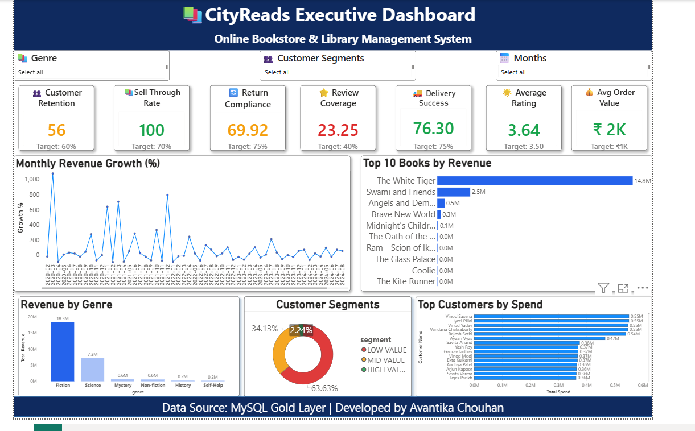

# 📚 Online Bookstore & Library Management System

### Data Engineering Capstone Project – Medallion Architecture

**Author:** Avantika Chouhan

---

# 📖 Project Overview

This project implements a complete **Medallion Data Pipeline** for an **Online Bookstore & Library Management System** using **MySQL** and **Power BI**.

The solution transforms raw operational data into business-ready insights through the **Bronze, Silver, and Gold** layers, followed by an interactive Executive Dashboard.

The project demonstrates end-to-end data engineering concepts including data ingestion, transformation, data quality validation, business KPI generation, pipeline auditing, and business intelligence reporting.

---

# 🎯 Project Objectives

- Design a Medallion Architecture data pipeline.
- Build Bronze, Silver and Gold layers.
- Implement incremental data loading.
- Apply data quality validation and enrichment.
- Generate executive KPI views.
- Build business analytical views.
- Monitor pipeline health.
- Develop an interactive Power BI dashboard.

---

# 🏗️ Medallion Architecture

```text
                    CSV Files
                         │
                         ▼
                ┌─────────────────┐
                │  Bronze Layer   │
                │ Raw Data Load   │
                └─────────────────┘
                         │
                         ▼
                ┌─────────────────┐
                │  Silver Layer   │
                │ Clean & Validate│
                └─────────────────┘
                         │
                         ▼
                ┌─────────────────┐
                │   Gold Layer    │
                │ KPI & Analytics │
                └─────────────────┘
                         │
                         ▼
              Executive Dashboard (Power BI)
```

---

# 🥉 Bronze Layer

The Bronze layer stores raw operational data without modification.

### Features

- Raw CSV ingestion
- Incremental loading
- Batch tracking
- Ingestion timestamps
- No transformations

---

# 🥈 Silver Layer

The Silver layer performs data cleansing, validation, and enrichment.

### Features

- Duplicate removal
- Data validation
- Invalid record rejection
- Business rule enforcement
- Order value calculation
- Loan overdue calculation
- Data enrichment

---

# 🥇 Gold Layer

The Gold layer provides business-ready analytical views.

## KPI Views

- Monthly Revenue Growth
- Customer Retention Rate
- Book Sell-Through Rate
- Library Return Compliance
- Review Coverage Rate

## Additional Business KPIs

- Average Order Value
- Delivery Success Rate
- Average Customer Rating

## Analytical Views

- Top Books by Revenue per Genre
- Customer Segments
- Top Customers
- Genre Performance

## Pipeline Audit

- Pipeline Health View
- Overall Pipeline Health Summary

---

# 📂 Project Structure

```text
Online-Bookstore-Library-Management-System/
│
├── cityreads_dataset/
├── docs/
│   ├── pipeline_design.md
│   └── PROJECT_DOCUMENTATION.md
│
├── powerbi/
│   └── CityReads_Executive_Dashboard.pbix
│
├── screenshots/
│
├── sql/
│   ├── 00_source_schema.sql
│   ├── task1_schema.sql
│   ├── task2_bronze_load.sql
│   ├── task3_silver_transform.sql
│   ├── task4_gold_views.sql
│   └── task5_audit.sql
│
├── testing/
│   ├── task1_validation.sql
│   ├── task2_validation.sql
│   ├── task3_validation.sql
│   ├── task4_validation.sql
│   └── task5_validation.sql
│
├── Dataset_generator.py
├── requirements.txt
├── README.md
└── .gitignore
```

---

# 🛠️ Technologies Used

- MySQL Server 8.0
- MySQL Workbench
- Power BI Desktop
- Python
- SQL
- Git
- GitHub
- CSV Files

---

# 🚀 Execution Order

Run the SQL files in the following order:

1. `00_source_schema.sql`
2. `task1_schema.sql`
3. `task1_validation.sql`
4. `task2_bronze_load.sql`
5. `task2_validation.sql`
6. `task3_silver_transform.sql`
7. `task3_validation.sql`
8. `task4_gold_views.sql`
9. `task4_validation.sql`
10. `task5_audit.sql`
11. `task5_validation.sql`

---

# 📊 Key Features

- Medallion Architecture Implementation
- Incremental Data Loading
- Data Cleaning & Validation
- Duplicate Detection
- Rejected Record Tracking
- Data Enrichment
- Business KPI Views
- Executive Power BI Dashboard
- Interactive KPI Cards
- Customer Segmentation
- Top Books Analysis
- Revenue & Genre Analytics
- Top Customers Analysis
- Pipeline Health Monitoring

---

# 📦 Deliverables

The repository includes:

### SQL Scripts

- Source Schema
- Task 1 – Schema Creation
- Task 2 – Bronze Layer
- Task 3 – Silver Layer
- Task 4 – Gold Layer
- Task 5 – Pipeline Audit

### Validation Scripts

- Task 1 Validation
- Task 2 Validation
- Task 3 Validation
- Task 4 Validation
- Task 5 Validation

### Documentation

- README.md
- PROJECT_DOCUMENTATION.md
- pipeline_design.md

### Dashboard

- Executive Power BI Dashboard
---

# 🌟 Additional Enhancements

Beyond the original capstone requirements, the following business enhancements were implemented:

- Average Order Value KPI
- Delivery Success Rate KPI
- Average Customer Rating KPI
- Top Customers Analytical View
- Genre Performance Analytical View
- Interactive Executive Power BI Dashboard

These enhancements extend the project beyond the mandatory requirements while demonstrating additional business analytics and reporting capabilities.

---


## 📷 Dashboard Preview



---

# 📄 Documentation

Detailed project documentation is available in:

```text
docs/PROJECT_DOCUMENTATION.md
```

The documentation includes:

- Project Design
- Task-wise Implementation
- SQL Logic
- Business Rules
- KPI Design
- Validation Process
- Dashboard Explanation
- Assumptions
- Additional Enhancements

---

# 👩‍💻 Author

**Avantika Chouhan**

Data Engineering Capstone Project

---

⭐ Thank you for visiting this repository.